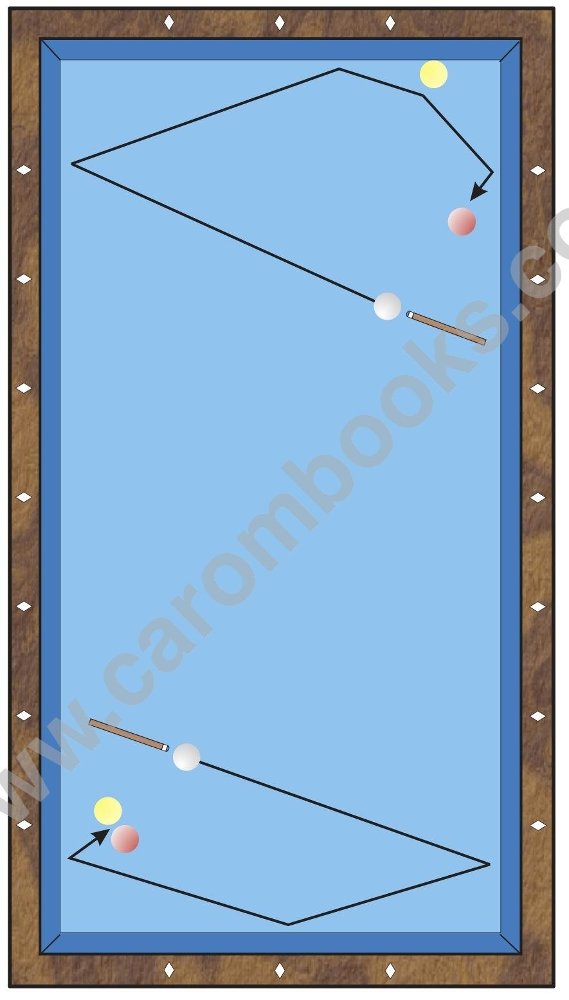

# Usage

The Japanese System is played without English and is especially useful for rail-first shots in the third of the table, an area where the Conti System which is played with a lot of English is problematic, since the angle of incidence into the first rail would be very “narrow” (see diagram 7).

The main field of application are shots with a sequence of rails of Long-Short-Long -Ball 2 and 3 or Long-Short-Ball 2-Long-Ball 3 as shown in the diagram.

**Vulnerability to Differences in the Material**

For this pattern, differences in the material have almost no influence. Only on very new tables B 1 slides a little bit at the first rail, so that the angle there opens. In that case, the aiming value at the first rail must slightly be increased.
