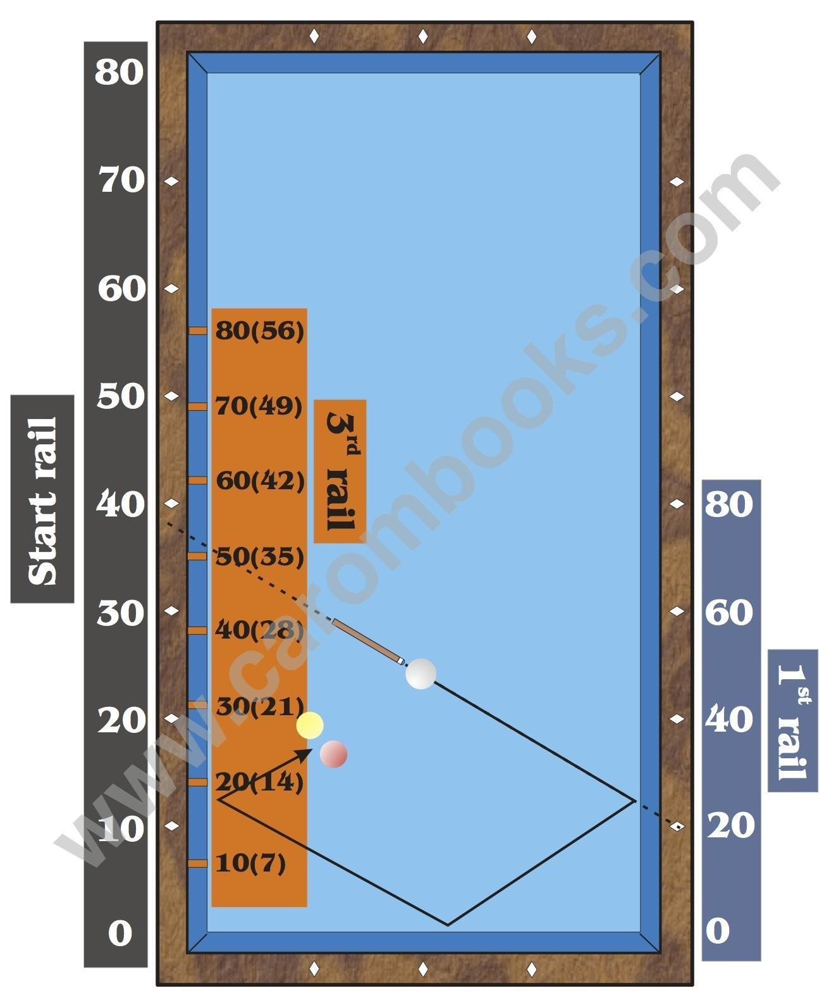

# The Numbering

## Start Rail
The values on the start rail relate to the points on the wooden rail (see dashed line).

The values increase regularly per diamond by 10 points.

## 1st Rail
The values on the first rail relate to the points on the wooden rail (see dashed line).

The values increase per diamond by 20 points from 0 to 80.

# 3rd Rail
The values on the third rail relate to the values on the front part of the rubber, vertical to the value on the wooden rail.

The values on the third rail equal 0.7 times the real distance between the diamonds. E.g. the value of 10 which is used for the calculation equals a real distance of 0.7 diamonds (or 7 units, the value in brackets) coming from the short rail, the value of 20 equals a real distance of 1.4 diamonds (14 units).

