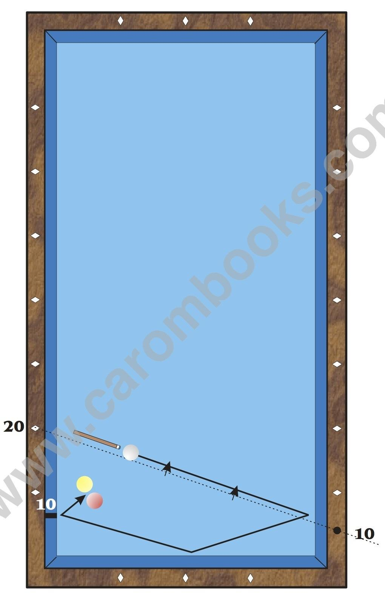
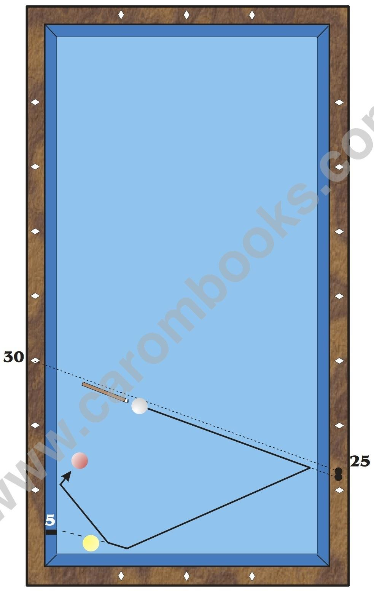

# How to Calculate Using Examples

## Example 1

**Instructions**

* Estimate the arrival on the third rail. In our example it is 10.

* Remember, that value 10 on the third rail is at 0.7 diamonds distance from the short rail.

* Choose a possible start value and insert it into the formula. E.g.: 20. That means: 20 - 10 = 10

* Put the cue along the line ”Start = 20” to “1st rail = 10”.

* Shift this line parallel until it crosses the cue ball. The point where this line reaches the long rail is your aiming point.


https://www.youtube.com/watch?v=XQteDTZJYC8


## Example 2

**Instructions**

* In order to determine the arrival value on the third rail, we must imagine where we had touched the third rail if B 2 would not divert the cue ball (dotted line). We receive a value of 5.

* Choose a possible start value and insert it into the formula, e.g. 30. The formula shows: 30 - 5 = 25.

* Put the cue along the line “Start = 30” to “1st rail = 25”.

* Shift this line parallel until it crosses the cue ball. The point where this line reaches the long rail is your aiming point.


https://www.youtube.com/watch?v=-KASeqIe1ws


