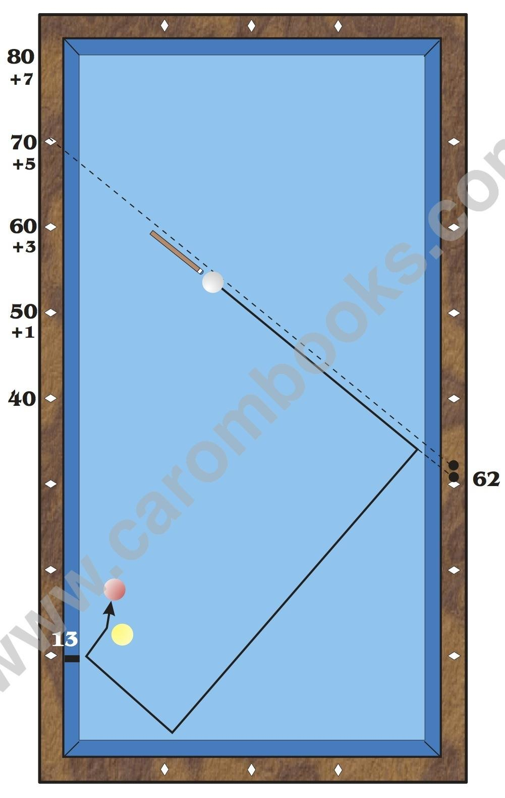

# Problematic Zones and Corrections

**Description**

If the start value is 40 or higher, you must make a small correction to the calculation. This is caused by the fact that the cue ball “slides” a little bit if the angle of incidence into the first rail is more shallow. Thus the value on the third rail increases slightly. On an average table we have the correction values - depending on the start value - as shown in the diagram. You must include them in the calculation in step 3.

* Estimate the arrival on the third rail. In this case it is 13.

* Select a possible start value on the rail in order to receive the correction value. Enter this estimated start value together with the correction value into the formula.

* The formula is 70 - 13 +5 = 62. Put the cue along the line “Start = 70” to “1st rail = 62”.

* Shift this line parallel until it crosses the cue ball. The point where this line reaches the long rail is your aiming point.

