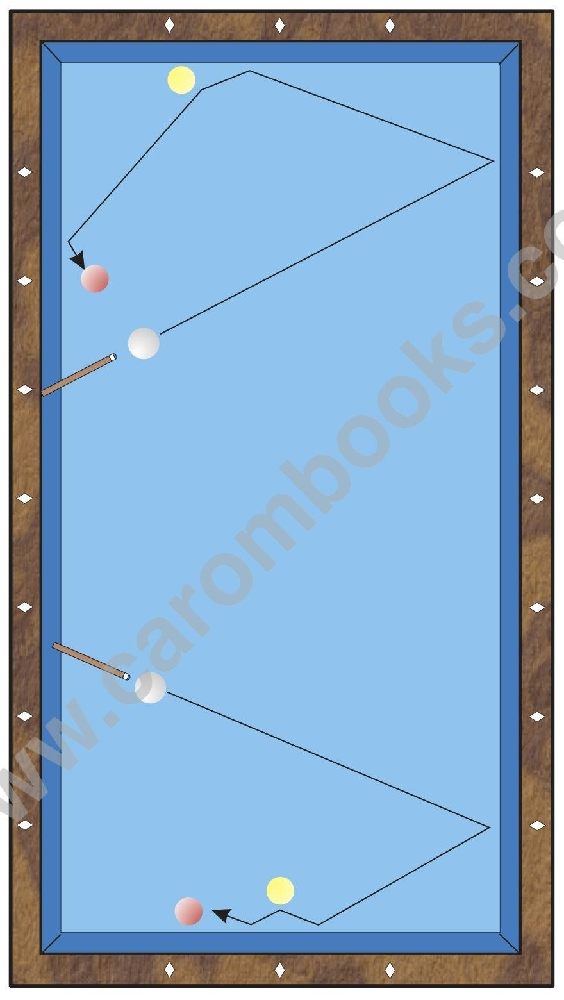

# Usage

**Description**

This system is mainly used in two fields of application: As shown in the diagram they are: „Long - Short - B 2 - Short“, where B 2 is hit on the inner side and „Long - Short - B 2 - Long“, where B 2 is hit on the outer side.

**Vulnerability to Differences in the Material**

Since this pattern is played without English and with moderate speed, differences in the material have almost no influence. Only on very new tables B 1 slides a little bit at the first rail, so that the angle opens there. In this case the aiming value at the first rail must slightly be increased.

