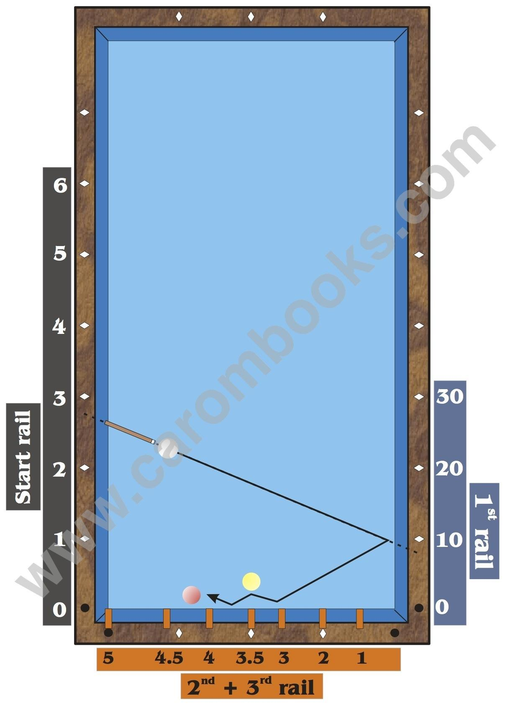

# The Numbering

**Start Rail**

The values on the start rail relate to the points on the wooden rail (see dashed line). One unit per diamond.

**1st Rail**

The values on the first rail relate to the points on the wooden rail (see dashed line).

The value increases by 10 points per diamond.

**2nd + 3rd Rail**

The values of the second and third rail relate to the values on the front part of the rubber, vertical to the value on the wooden rail.

The value of 1 is located at a distance of half a diamond from the corner, the value of 2 at the first diamond. 3 is located at a distance of 1.6 dia. from the corner, 3.5 at the 2nd dia., 4 at 2.6 dia., 4.5 at 3.2 dia. and 5 exactly in the corner.

