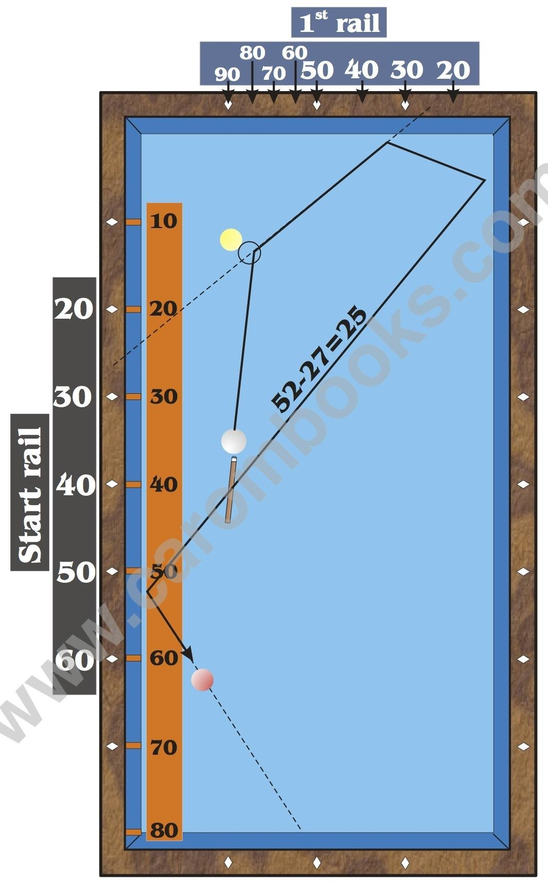

# Example of a Calculation off B 2

Before we start the calculation, we need to consider a few things. When we play, we touch B 2 on the right hand side. The track after hitting B 2 shows you the values which are necessary for the calculation. You must not use the line which crosses the center of B 2 but use a line which is one ball diameter to the right instead, because this is the actual track of the cue ball.

**Instructions**

* Estimate the arrival at the 3rd rail. In our example it is 52.

* Choose a possible start value and insert it into the formula.3rd rail 52 - start rail 27 = 1st rail 25.

* The result of the calculation is the value on the 1st rail. Now imagine a line from the chosen start value (27) to the value on the 1st rail (25). If you realize, that this line is far away from B 2, you try another start value and insert it into the formula. This line must pass B 2 one ball diameter away from its center.

* If the line is close to the cue ball (less than 5 cm), you just shift it parallel. The point where this line reaches the first rail is your aiming point.


https://www.youtube.com/watch?v=5aQvU2UHCIA

