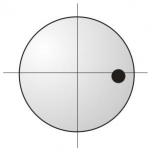

# Zone 2

**Zone 2: Start Rail between 0 and 80, First Rail with Value 0 or 00**

**Instructions**

If you aim at 0 on the first rail, different rules apply. Depending on the start value a correction value must be added. If you play from 30 to 0, as shown in the diagram, 15 points are added (the number in the circle), so that you arrive at 45 on the third rail. The correction values can slightly differ from table to table.

The technique stays the same as in zone 1, where the amount of English is determined by the reference line from 30 to 30 and the planned arrival value of 60.


https://www.youtube.com/watch?v=aGsJOEx5Bes


## Extreme Values when Aiming at 00 with Maximum English

**Instructions**

Very helpful is the knowledge about the arrival values for the pattern Short-Long-Long, when you play exactly into the corner (00) with maximum English and slightly higher speed (correction values in the grey circle). The values in the blue circle are the correction values when aiming at 0, playing with normal English (see preceding page). They are written here for your comparison.

All these values can slightly differ from table to table.

> Hint

_Play the maximum values on your table and compare them to the values shown here._

> Technique

_Maximum English, a bit below center with slightly increased speed._


https://www.youtube.com/watch?v=f64V86OEIp8


## Example of Usage in the Problematic Zones

**Instructions**

Estimate the arrival on the third rail. In our example it is 40.

Select a possible start value and insert it into the formula: arrival rail 40 - start rail 30 = first rail 10. The value of 10 however, does not belong anymore to zone 1 but to zone 2, where you aim at 0. Using our standard stroke we have a correction value of +15 when coming from 30. This means that the maximum arrival value would be 45 because (30 + 15 = 45). But if you aim at 00 with maximum English you have a correction value of +6 and thus have a possible arrival of 36.

**Summary**

* Planned arrival = 40

* From 30 to 0 with standard stroke = 45

* From 30 to 00 with maximum English and higher speed = 36

* Now you have the choice. Either you aim at 0 with the standard stroke but a little bit more English than normal, or with maximum English and increased speed a little bit (1 to 2 points) before the corner. Anyway, you must use your experience and feeling.


https://www.youtube.com/watch?v=5hp6FVXurNg

