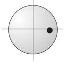
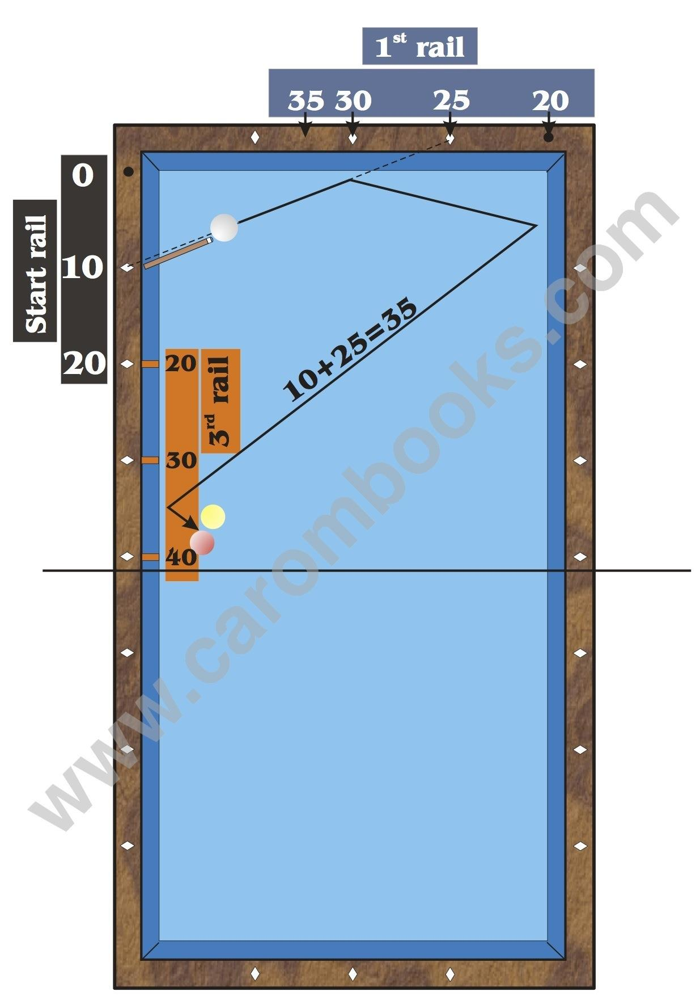

# Zone 3

**Zone 3: Start Rail between 0 and 20, Arrival at 3rd Rail up to 40**

Zone 3 is defined by a start value of 0 to 20 and an arrival at the third rail up to 40.

Attention! In zone 3 the numbering of the first rail changes (see diagram).

In this area you play with maximum English and normal, calm standard speed.

**Instructions**

* Estimate the arrival at the third rail. In our example it is 35.

* Choose a possible start value and insert it into the formula. **3rd rail 35 - start rail 10 = 1st rail 25.**

* The result of the calculation is the value on the first rail. Now imagine a line from the chosen start value (10) to the value on the first rail (25). If you realize, that this line is far away from the cue ball, you try another start value and insert it into the formula.

* If the line is close to the cue ball (less than 5 cm), you just shift it parallel, till you cross exactly the center of the cue ball. The point where this line reaches the first rail is your aiming point.


https://www.youtube.com/watch?v=O3yA5DAlZRk
