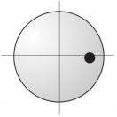

# Zone 4

**Zone 4: Start Rail between 10 and 20, Arrival at 40 to 80**

Contrary to other authors, I think that a calculation in this zone, when coming from less than 10, is completely worthless. Being close to the rail and the sensitivity to differences in English and speed caused by this, do not produce the needed accuracy, so that it is better to rely on your feeling. Even a start value between 10 and 20 is very problematic when arriving at a value higher than 40. Strategies which are proposed in several other billiard training books with sometimes very high correction values are not nearly satisfyingly accurate. Therefore I suggest another approach:

I change the numbering of the first rail so that the values equal exactly the arrival values on the third rail. This will avoid any calculation, but requires a certain brain power, because you must memorize the numbering for the first rail coming from 20 and 10. If the cue ball is positioned somewhere between a start value of 10 and 20 I look for the respective aiming points, once for 10 and then for 20 and look for the aiming point inbetween. In the example on the next page this approach is explained in detail.

In this area you play with maximum English and normal, calm standard speed.

## Numbering

Start Value 10
Start value 10: 40 is positioned at 2.25 dia. from the left corner, 50 at 1.5 dia., 60 at the 1st dia., 70 at 0.8 dia. and 80 at 0.7 dia.

Start Value 20
Start value 20: 40 is positioned at 3.5 dia., 50 at 2.5 dia., 55 at the 2nd dia., 65 at 1.5 dia., From here on ⅓ dia. equals 5 points.

## Example

**Instructions**

* Estimate the arrival on the third rail. In our example it is 55.

* In this zone the arrival value of 55 corresponds with value 55 on the first rail. Since we start between 10 and 20, we locate value 55 both for a start value of 10 and a start value of 20 using the numbering on the preceding page.

* Our aiming point is positioned between the two points for 55. It should be in the same relation to the 55 values’ positions as the start values. In the end this is just an estimation and requires a lot of feeling. A simple parallel shift of the track from 10 or from 20 generates a considerable error in this sensitive zone regarding the arrival at the third rail.

