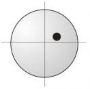
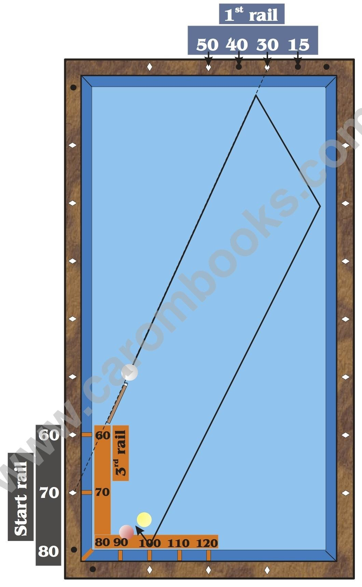

# Zone 5

**Zone 5: Start Rail between 60 and 80, Arrival at 60 to 120**

Also this zone is very sensitive regarding the amount of English as well as differences in material and stroke. It is treated differently by other authors of billiard books. I, personally, think that in this area a calculation is not very wise. Additionally, since we aim at a value between 0 and 15 on the first rail we are already in the area of the corner plunge. Aiming at 0 has already separately been explained in detail.

Despite all these problems it does not hurt to deal with the Plus System also in this zone.

As soon as you start from the bottom rail, I suggest systems which are more modern like the Tüzül-System.

The technique is the same as in zone 1, where the amount of English is determined by the reference line from 30 to 30 and the planned arrival at 60.

## Numbering

On the first rail the numbering changes. At a distance of 0.5 dia. from the corner is now the value of 15. On the third rail the arrival values are extended up to 120.

## Example

**Instructions**

* Estimate the arrival at the third rail. In this example it is 100.

* Choose a possible start value and insert it into the formula.

* 3rd rail 100 - start rail 70 = 1st rail 30.

* The result of the calculation is the value on the first rail. Now imagine a line from the chosen start value (70) to the value on the first rail (30). If you realize, that this line is far away from the cue ball, you try another start value and insert it into the formula.

* If the line is close to the cue ball (less than 5 cm), you just shift it parallel, till you cross exactly the center of the cue ball. The point where this line reaches the first rail is your aiming point.


https://www.youtube.com/watch?v=e7XQpaOx2rE


