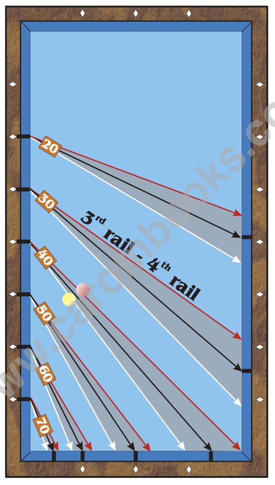

# The Paths from the Third to the Fourth Rail

**Description**

The paths from the third to the fourth rail also depend very much on the material. In the diagram the paths on an average table are depicted as black lines, for an old, used cloth the red ones apply and for a rather new cloth the white lines. Especially when the cue ball touches the third rail in a quite narrow angle, meaning the paths of 20 and 30, enormous differences in the arrival at the fourth rail can occur.

Quite reliable auxiliary lines are the paths from 70 to 0.5 dia. on the short rail, from 60 to the 1st dia., always on the assumption of an average table.

The path from 40 normally goes to 3.5 dia. on the short rail.

